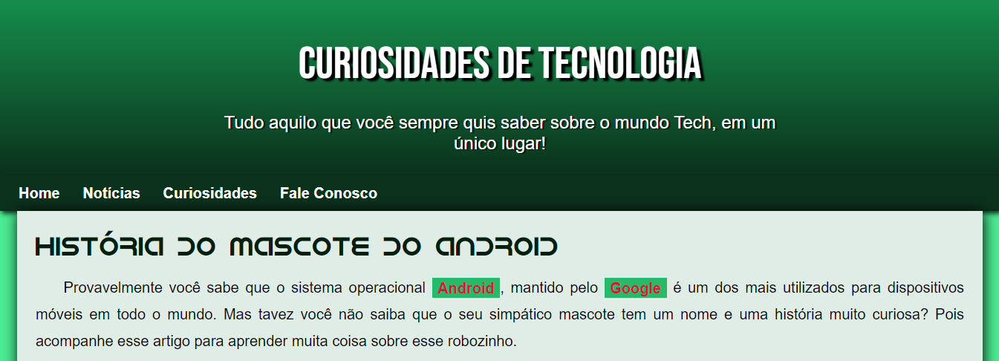
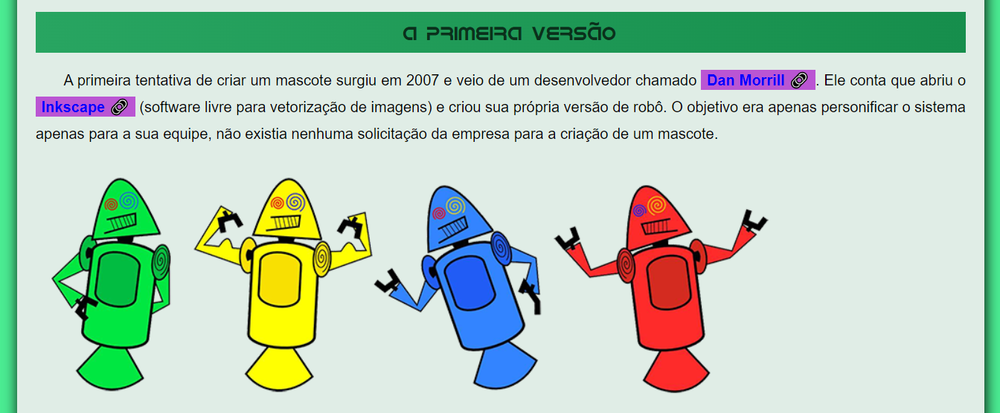
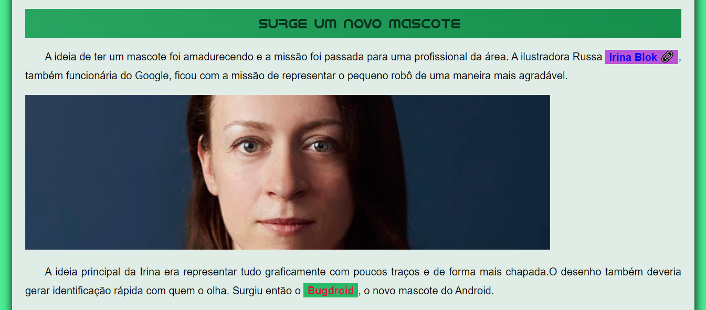
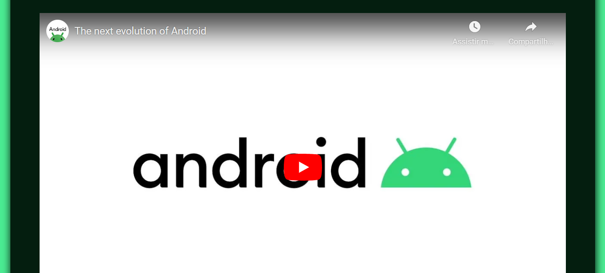
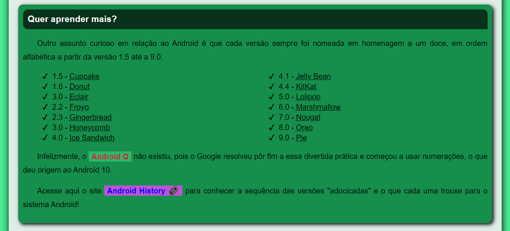
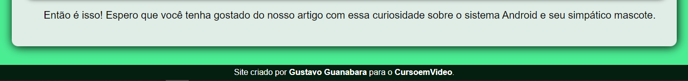

# PROJETO ANDROID
👨‍🏫PROJETO FEITO PARA O CURSO DE HTML E CSS DO CURSO EM VIDEO.

 <br>
 <br>
 <br>
 <br>
 <br>
 <br>

## DESCRIÇÃO:
Este é um código HTML e CSS para uma página da web sobre curiosidades de tecnologia, focando na história do mascote do Android. Aqui estão as principais partes do código:

### HTML (`CODIGO.html`):
1. **Meta Tags e Título:**
   - Define o conjunto de caracteres, a compatibilidade com o Internet Explorer e a configuração da viewport.
   - Define o título da página como "ANDROID".

2. **Vinculação de Estilos e Ícone:**
   - Vincula um arquivo de estilo externo (`../CSS/CODIGO.css`).
   - Define um ícone para a aba do navegador (`../MIDIAS/favicon.ico`).

3. **Cabeçalho (`<header>`):**
   - Inclui um título (`<h1>`) e um parágrafo com uma breve descrição do conteúdo.

4. **Navegação (`<nav>`):**
   - Lista de links de navegação, incluindo "Home", "Notícias", "Curiosidades" e "Fale Conosco".

5. **Conteúdo Principal (`<main>`):**
   - Contém informações sobre a história do mascote do Android, dividido em tópicos como "A primeira versão", "Surge um novo mascote" e informações adicionais.
   - Inclui imagens, links externos e um vídeo do YouTube incorporado.
   - Usa as tags `<h1>`, `<h2>`, `<p>`, `<strong>`, ``, `<picture>`, `<iframe>`, e `<aside>`.

6. **Rodapé (`<footer>`):**
   - Inclui informações sobre o criador do site com um link para o perfil do GitHub e para o canal do YouTube.

### CSS (`../CSS/CODIGO.css`):
1. **Definições Globais:**
   - Define a família de fontes (`Bebas Neue` e `Android`).
   - Define variáveis de cor e outras propriedades usando a raiz (`:root`).

2. **Estilos Gerais:**
   - Define estilos para o corpo, cabeçalho, navegação, conteúdo principal e rodapé.
   - Utiliza gradientes, sombras e bordas arredondadas para melhorar o design.

3. **Estilos para Elementos Específicos:**
   - Estiliza o cabeçalho (`header > h1` e `header > p`), a navegação (`nav > a` e `nav > a:hover`), o conteúdo principal (`main`), o vídeo (`div.video` e `div.video > iframe`), e a seção adicional (`aside`).

4. **Estilos para Links:**
   - Define estilos para links (`main a` e `main a:hover`), incluindo a aparência de links externos (`a.externo::after`).

5. **Estilos para Listas:**
   - Estiliza a lista (`aside > ul`) com marcadores personalizados.

6. **Estilos para o Rodapé:**
   - Define a aparência do rodapé e estiliza os links no rodapé.

### CONSIDERAÇÕES ADICIONAIS:
   - O código utiliza fontes personalizadas (`Bebas Neue` e `Android`) que devem estar disponíveis nos arquivos de fontes (`../FONTES/`).
   - A página tem um design responsivo, ajustando-se a diferentes larguras de tela.
   - Há um uso criativo de cores, gradientes e sombras para melhorar a estética visual.
   - Links externos têm um ícone representando um link após o texto (`\00A0\1F517`).
   - A página incorpora um vídeo do YouTube sobre o mascote do Android.

## COMO USAR?
* Clone o repositório para o seu sistema local:

```bash
git clone https://github.com/VILHALVA/PROJETO-ANDROID.git
```

* Navegue até o diretório do projeto.

```bash
cd PROJETO-ANDROID
```

* Descompacte o arquivo ZIP (se você baixou manualmente):

```bash
unzip PROJETO-ANDROID.zip
```
* Abra o arquivo `CODIGO.html` em seu navegador de preferência.

## NÃO SABE?
- Entendemos que para manipular arquivos em `HTML`, `CSS` e outras linguagens relacionadas, é necessário possuir conhecimento nessas áreas. Para auxiliar nesse aprendizado, oferecemos cursos gratuitos disponíveis:
* [Curso de HTML e CSS](https://github.com/VILHALVA/CURSO-DE-HTML-E-CSS)
* [Curso de JavaScript](https://github.com/VILHALVA/CURSO-DE-JAVASCRIPT)
* [Confira mais cursos](https://github.com/VILHALVA?tab=repositories&q=+topic:CURSO)

## CREDITOS:
- [PROJETO FEITO PELO VILHALVA](https://github.com/VILHALVA)
- [PROJETO FEITO PARA O CURSO DE HTML E CSS](https://github.com/VILHALVA/CURSO-DE-HTML-E-CSS)
- [ESTÁ DISPONIVEL NO SITE](https://vilhalva.github.io/STYLER/STYLER.html)


